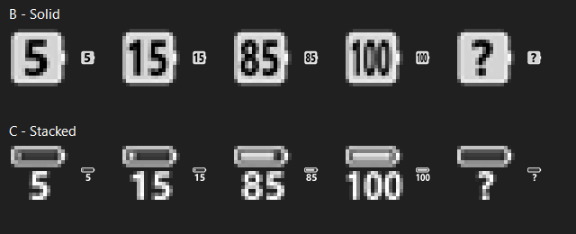

# BatteryBar

**A lightweight Windows 11 battery tray app with readable percentage icons and live power statistics.**

BatteryBar puts your battery percentage in the system tray. Hover for charging or discharging power, estimated time remaining, and time weighted averages over the last 1, 5, 10, and 30 minutes. Choose between two icon layouts, customize colors and thresholds, and optionally start it at sign in.

## Quick start

1. Download `dist/BatteryBar.exe` from this repository, or build it from source with `./build.ps1` in Windows PowerShell.
2. Run `BatteryBar.exe`. If the icon is hidden, drag it from the notification overflow onto the taskbar.
3. Right click the icon to open settings or exit. Hover to see power details.

**Requirements:** Windows 11, .NET Framework 4.x, and a device with a battery for live readings. The executable is unsigned and Windows may display a publisher warning. The app runs locally and has no network dependency; settings are saved under `%LOCALAPPDATA%\BatteryBar\settings.xml`.

## Features

- Two crisp tray icon layouts at 16, 20, 24, and 32 pixels; shows `?` when battery percentage is unavailable.
- Live charging and discharging power, plus separate time weighted averages for 1, 5, 10, and 30 minutes. Availability depends on the battery driver.
- Custom status colors, low and full thresholds, refresh interval, and optional current user sign in startup.
- Windows 11 acrylic hover panel when supported by the system, with a plain background fallback.
- No installer, account, telemetry, or third party package dependencies.

## Build and verify

Run `./build.ps1` and `./tests/Verify.ps1` from Windows PowerShell. The build uses the .NET Framework C# compiler bundled with Windows. The build script replaces `dist/BatteryBar.exe` and stops that exact running executable if necessary. Additional C# test sources are in `tests/`.

## Contributing

Issues and pull requests are welcome. Please include your Windows build, battery hardware or driver details, steps to reproduce, and screenshots where useful. See [CONTRIBUTING.md](CONTRIBUTING.md).

## License

MIT. See [LICENSE](LICENSE).

---

## 中文说明

Windows 11 电池托盘工具。运行 `dist/BatteryBar.exe`，右键托盘图标打开设置或退出。

## 图标样式

在设置的“托盘图标样式”中选择，点击“保存”立即应用：

- **数字在电池内**（默认）：彩色实心电池，内部显示电量数字。
- **数字在电池外**：上方为细电池，下方为电量数字。

电池采用圆角、小电极和半透明状态色，不使用高光或渐变。B 的底色不透明度约 84%，数字保持不透明；C 使用浅透明底及垂直居中的状态色电量条，数字底部预留抗锯齿空间。托盘图标不包含对任务栏背景的实时模糊。造型参考微软 Fluent 小尺寸图标的简洁轮廓原则：https://fluent2.microsoft.design/iconography 。

两者都使用单个正方形托盘图标，不带百分号；按系统小图标尺寸绘制，支持 16、20、24、32 像素。以 16 像素为基准，B 的主体高 14 像素、数字区域高 10 像素；C 的电池高 6 像素、数字高 9 像素，中间间隔 1 像素，整体用满 16 像素。数字使用 Segoe UI 粗体轮廓抗锯齿绘制，按可用区域适配宽度，保证 100 不越界。设置窗口按文字尺寸自动排版，包含大尺寸四状态预览。C 的电池内部短线表示电量，0% 时留空。未知电量显示 `?`。原有配置没有样式字段时默认选择 B。

设置还可调整四种状态颜色、电量阈值、刷新间隔和当前用户登录自启动。设置存放在 `%LOCALAPPDATA%\BatteryBar\settings.xml`。默认放电色为紫色；旧默认浅白色自动迁移，其他自定义颜色保留。

图标可能出现在任务栏的隐藏图标菜单中，可手动拖到外面。悬停显示硬件提供的功率和预计时间；驱动不提供的数据显示不可用，充满时间为估算。满电阈值仅影响显示，不控制充电上限。

## 悬停功率统计

悬停窗口使用 Windows 11 Build 22621 起提供的 Desktop Acrylic 系统背景模糊（DWM），不是模糊文字。系统不支持、关闭透明效果、高对比度或开启省电时，显示普通背景。仅显示窗口时申请背景效果，隐藏后撤销；不新增截图采样或动画定时器。背景是否实际呈现模糊由 Windows 合成器决定。

悬停约半秒显示详情，包含驱动最近一次报告的瞬时充/放电功率、预计时间，以及最近 1、5、10、30 分钟的平均充电和平均放电功率。

- 两个方向单独按有效采样时长加权，不相互抵消。每个平均值旁显示其有效时长；没有有效数据时为 `—`，不把缺测当成零。
- 仅在内存中保存最近 30 分钟数据，退出清空；刚启动需要至少两次有效采样才能计算平均值。
- 方向切换、无效读数之间的间隔不计入统计；睡眠期间不采样、不插值，恢复后重新建立采样起点。
- 为支持 1 分钟窗口，后台采样间隔取设置值与 30 秒的较小值；悬停期间每约 2 秒更新，移开后恢复低频采样。瞬时值仍受电池驱动自身更新频率限制。

## 登录自启动

设置中的自启动使用当前用户的 `BatteryBar-Logon-<用户 SID>` 计划任务，登录触发且无主动延迟，普通权限运行，不存储密码。电池供电允许启动，拔掉电源不终止，不要求网络或空闲，不唤醒电脑，无运行时长上限。

启用成功后删除指向同一路径的旧 `HKCU\...\Run\BatteryBar` 注册表项，避免重复启动。取消勾选会删除任务。移动程序后需重新启用自启动更新路径。配置失败会提示错误，不强制提升程序权限。相比 Run 启动项可以避开其延迟机制，但仍依赖 Windows 登录、任务计划程序和 Explorer 就绪，不能保证具体提前秒数。

## 编译与验证

Windows PowerShell 中运行 `./build.ps1`，使用系统 .NET Framework C# 编译器，无需额外 NuGet 依赖。脚本会退出此工作目录下正在运行的 BatteryBar 实例，再覆盖 `dist/BatteryBar.exe`，不生成带版本后缀的程序。程序没有可关闭主窗口时会结束该进程，内存中的功率历史随之清空。

运行 `./tests/Verify.ps1` 检查设置兼容性、样式持久化、图标尺寸和数字边界，并生成 `dist/icon-check.png`。此检查不会修改实际用户设置或自启动项。未据此验证真实硬件上的耗电量或所有多屏 DPI 组合。
